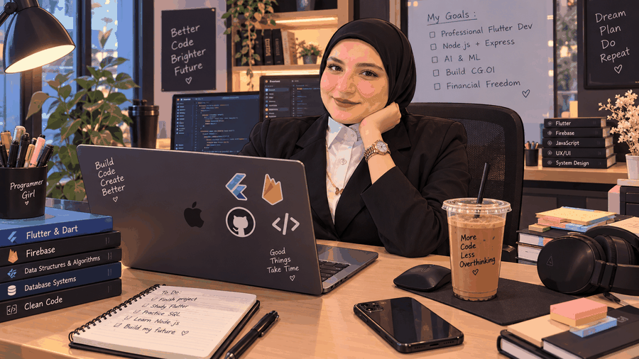

<!-- =========================================================
     MARWA GHARIB ALSAYED MOHAMED
     GitHub Profile README
========================================================= -->

<!-- ========================= HERO ========================= -->

  <!-- Main Cartoon -->
  

    

  <!-- ================= NAME ================= -->

  

   

  <!-- Small Beige Accent -->
  

    

  <!-- Burgundy Line -->
  

    

  <!-- Social Buttons -->

  

  

  

  

<!-- =========================================================
     ABOUT ME
========================================================= -->

<h2 align="center">👩🏻‍💻 About Me</h2>

 

  <em>
    Turning ideas into beautiful, functional and meaningful digital experiences.
  </em>

 

  I am <strong>Marwa Gharib Alsayed Mohamed</strong> — a Business Information
  Systems graduate and software engineer passionate about building beautiful,
  responsive applications with clean code and thoughtful design.

 

| ✦ | What I Do |
|:---:|:---|
| 📱 | **Cross-Platform Development** — Flutter & Dart |
| 🔥 | **Backend & APIs** — Firebase · REST APIs · Node.js |
| 🎨 | **Creative Development** — UI/UX · Responsive Design |
| 🧩 | **Architecture** — Clean Code · Reusable Components |
| 🌱 | **Growth** — Continuous Learning & Development |

  

<!-- =========================================================
     DREAM PLAN
========================================================= -->

<h2 align="center">🎯 My Dream Plan</h2>

 

| | Goal |
|:---:|:---|
| ☐ | ✨ Professional Flutter Developer |
| ☐ | 🟤 Master Node.js & Express Backend |
| ☐ | 🤖 Explore AI & Machine Learning |
| ☐ | 🎨 Build Amazing UI/UX Experiences |
| ☐ | 💰 Achieve Financial Freedom |
| ☐ | ❤️ Create Real Impact |

  

<!-- =========================================================
     BEIGE ACCENT
========================================================= -->

  

  

<!-- =========================================================
     TECH STACK
========================================================= -->

<h2 align="center">🛠️ Tech Stack</h2>

 

  

 

<strong>Languages</strong>

`Dart` · `JavaScript` · `C++` · `HTML` · `CSS`

  

<strong>Frameworks & Backend</strong>

`Flutter` · `React` · `Next.js` · `Node.js` · `Express`

  

<strong>Tools</strong>

`Firebase` · `Git` · `GitHub` · `Figma` · `Photoshop`

  

<strong>Design</strong>

`UI/UX` · `Responsive Design` · `Visual Design`

  

<!-- =========================================================
     BURGUNDY WAVE
========================================================= -->

  

 

<!-- =========================================================
     PROJECTS
========================================================= -->

<h2 align="center">🚀 Featured Projects</h2>

 

| 🎯 Project | 📝 Description | 💻 Stack |
|:---|:---|:---|
| **[CG.OI](https://github.com/marwa906/Graduation-project-application)** | Career guidance, interview preparation & career matching platform | Flutter · Node.js · Firebase |
| **[Flutter Training](https://github.com/marwa906/nti)** | Mobile application development training projects | Flutter · Dart · Firebase |
| **[Stylish](https://github.com/marwa906/stylish)** | Responsive UI/UX focused frontend project | HTML · CSS · JavaScript |

  

<!-- =========================================================
     GITHUB STATS
========================================================= -->

<h2 align="center">📊 GitHub Dashboard</h2>

 

  

  

  

  

  

  

  

<!-- =========================================================
     EXPERIENCE
========================================================= -->

<h2 align="center">💼 Experience & Education</h2>

 

### 🏢 Professional Experience

 

- **Website & Mobile Application Lead** — New Obour City Authority

 

- **COO & HR Manager** — Velux Events & Conference Organizing Company

 

- **Freelance Graphic Designer** — 2021–Present

 

### 🎓 Education

 

- **B.I.S. in Business Information Systems** — Obour Institute, 2026

 

- **Mobile Application Development Training** — National Telecommunication Institute (NTI)

  

<!-- =========================================================
     CURRENTLY LEARNING
========================================================= -->

<h2 align="center">🌱 Currently Learning</h2>

 

### `Node.js` · `Express` · `Backend Development`

 

### `AI & ML` · `Advanced Flutter` · `System Design`

  

<!-- =========================================================
     CODING PHILOSOPHY
========================================================= -->

<h2 align="center">💭 My Coding Philosophy</h2>

 

  

<strong>
Build Code. Create Better. Achieve Freedom.
</strong>

  

🧩 **Clean Code**

&nbsp;&nbsp;&nbsp;•&nbsp;&nbsp;&nbsp;

♻️ **Reusable Components**

&nbsp;&nbsp;&nbsp;•&nbsp;&nbsp;&nbsp;

🎨 **User-First Design**

  

📚 **Continuous Learning**

&nbsp;&nbsp;&nbsp;•&nbsp;&nbsp;&nbsp;

💡 **Creative Problem Solving**

  

<!-- =========================================================
     FINAL ANIMATION
========================================================= -->

  

  

<!-- =========================================================
     FOOTER
========================================================= -->

  

   

  <h2>🐈‍⬛ More Code · Less Overthinking 🐈‍⬛</h2>

   

  

    <em>Building today what I dream about tomorrow.</em>
  

   

  
    Made with ❤️ & ☕ by <strong>Marwa</strong>
  

    

  

