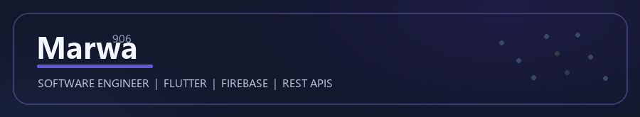
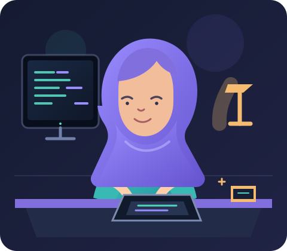

  

  

  
  
  

> 🐱━━━━━━━━━━━━━━━━━━━━━━━━━━━━━━━━━━━━━━━━━━━━━━━🐱

## 👩‍💻 About Me

  

I am **Marwa Gharib Alsayed Mohamed** — a Business Information Systems graduate and software engineer focused on building useful digital experiences through clean design, reliable code, and thoughtful problem solving.

- 📱 Building cross-platform apps with **Flutter** and **Dart**
- 🔥 Working with **Firebase**, REST APIs, and modern UI patterns
- 🎨 Combining engineering with **design thinking** and visual creativity
- 🧠 Passionate about **clean architecture**, learning, and continuous growth
- 🌍 Based in Egypt and open to meaningful opportunities

> 🐾━━━━━━━━━━━━━━━━━━━━━━━━━━━━━━━━━━━━━━━━━━━━━━━🐾

## 🎯 My Goals

- [ ] Professional Flutter Developer
- [ ] Node.js + Express Mastery
- [ ] AI & Machine Learning
- [ ] Build Great Products with Real Impact
- [ ] Financial Freedom
- [ ] Create Value for People and Communities

> 🐱━━━━━━━━━━━━━━━━━━━━━━━━━━━━━━━━━━━━━━━━━━━━━━━🐱

## 🛠️ Tech Stack

  

> 🐾━━━━━━━━━━━━━━━━━━━━━━━━━━━━━━━━━━━━━━━━━━━━━━━🐾

## 🚀 Featured Projects

| Project | Description | Stack |
|---|---|---|
| [CG.OI — Career Support Platform](https://github.com/marwa906/Graduation-project-application) | Career support platform for CV guidance, interview prep, and career matching. | Flutter · Node.js · Firebase |
| [Flutter Training Projects](https://github.com/marwa906/nti) | Learning-focused mobile projects during practical training. | Flutter · Dart · Firebase |
| [Stylish](https://github.com/marwa906/stylish) | Front-end project focused on responsive styling and polished UI. | HTML · CSS · JavaScript |

> 🐱━━━━━━━━━━━━━━━━━━━━━━━━━━━━━━━━━━━━━━━━━━━━━━━🐱

## 📊 GitHub Dashboard

  
  

  

  <a href="https://github.com/marwa906?tab=overview">Explore my contribution activity on GitHub ↗</a>

> 🐾━━━━━━━━━━━━━━━━━━━━━━━━━━━━━━━━━━━━━━━━━━━━━━━🐾

## 💼 Experience & Education

- **Website & Mobile Application Lead** — New Obour City Authority
- **COO & HR Manager** — Velux Events & Conference Organizing Company
- **Freelance Graphic Designer** — 2021–Present
- **B.I.S. in Business Information Systems** — Obour Institute, 2026
- **Mobile Application Development Training** — National Telecommunication Institute (NTI)

> 🐱━━━━━━━━━━━━━━━━━━━━━━━━━━━━━━━━━━━━━━━━━━━━━━━🐱

## 🌟 My Coding Philosophy

> “Great products happen when thoughtful design meets purposeful technology.”

I care about readable code, reusable components, smooth experiences, and solutions that make a real difference.

  
   
  🐈‍⬛ 🐈 🐈‍⬛ &nbsp; <b>More Code, Less Overthinking</b> &nbsp; 🐈‍⬛ 🐈 🐈‍⬛

